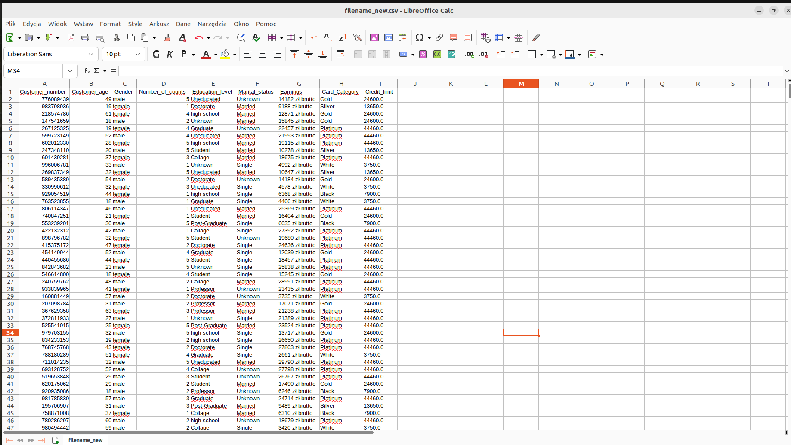
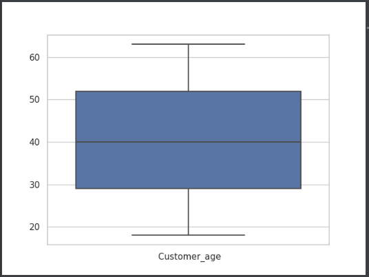
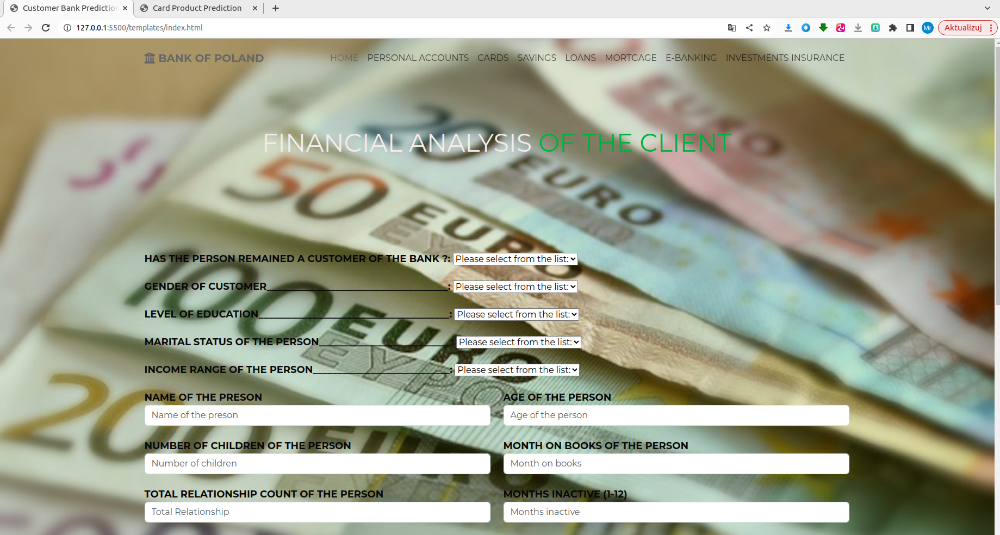

# Bank Customer Prediction

## Purpose of the program

This is a machine learning project where we will be building a model to predict the types of cards a bank might sell or try to sell to its customers

## Describe

In a dataset that contains information about people who use cards issued by a particular bank, we find certain characteristics of these people, which include information about family, marital status and how often and how they use cards issued by the bank. We will now use this dataset to predict the type of car a particular customer might be able to buy. 

The project is divided into 3 parts:
1. Building a machine learning model - predicting the type of car a customer might buy;
2. Django-based web application;
3. deployment of the project on Heroku via GitHub.

## Avg Utilization Ratio: 
it's how much you currently owe divided by your credit limit. It is generally expressed as a percent.  For example, if you have a total of 2000Euro in credit available on two credit cards, and a balance of 1000E on one, your credit  utilization rate is 50% — you're using half of the total credit you have available. A low credit utilization rate shows you're # using less of your available credit.

## Resluts:
 

csv file

 

In the columns, showing the value of the average age of the customer. So what does this box chart suggest? Now this box plot shows that most of the current values are actually between <a, b>. Because the file is built randomly so this data changes each time the file is run. The line representing the median or mean value is actually the average value. And this field says that most of the values are only present inside this field, which ranges from <a.b> If dots appear it means that there are some outliers, which means that these are outliers that are categorised as outliers in relation to the rest of the values that are present in this field. So for example age 70 and 74, 75 is considered an outlier. So these are very small outliers. So we can say that the age of the client is actually a pdoble column and it's not going to mess up the model when we train it using this data or this column. 

 

First step of design' www

## Created by Adrian Szklarski, start time 04-06.2023/ Under construction, yet

